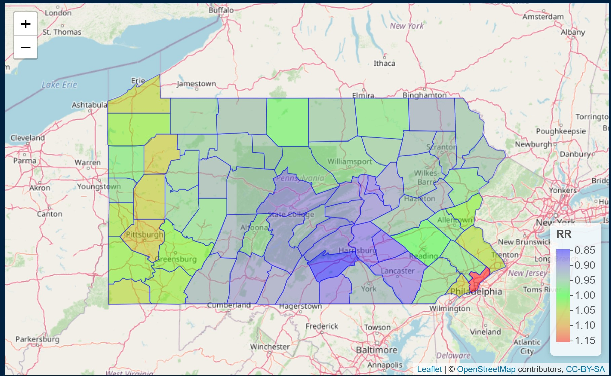

```{r setup, include=FALSE}
knitr::opts_chunk$set(echo = TRUE)
library(dplyr)
library(tidyverse)
library(ggplot2)
library(maps)
library(maptools)
library(sf)
library(SpatialEpi)
library(spdep)
library(readr)
library(readr)
library(ggmap)
library(maps)
library(ggthemes)
library(CARBayes)
library(reshape2)
#devtools::install_github("UrbanInstitute/urbnmapr")
library(urbnmapr)
library(usmap)
library(arm)
#install.packages("INLA",repos=c(getOption("repos"),INLA="https://inla.r-inla-download.org/R/stable"), dep=TRUE)
library(INLA)
```


# 1.0 Introduction 

Cancer is a group of disease characterized by the uncontrolled growth and spread of abnormal cells that can results in death if not treated. Cancer varies by root or source, for instance, cancer that is rooted in the lung is referred as the lung cancer. Lung cancer is a type of cancer that develop when cells in the lung change. The change is triggered when people breathe in dangerous, toxic substance. Hence, the number one risk factor of lung cancer is "smoking." According to Center for Control and Disease Prevention (CDC), smoking accounts for about 90\% of lung cancer cases worldwide. Other risk factors include radon, hazardous chemicals, particle pollution, gene etc. At the early stage, lung cancer can be attributed with symptoms such as incessant cough, constant chest pain, shortness of breath, pneumonia, coughing up blood etc., while at the later stage when lung cancer might have spread to other organs of the body, obvious symptoms like weight loss, loss of appetite, headaches, bone pain or fracture, blood clots etc., may show up. 

Lung cancer is the leading cancer killer in both men and women in the United States in 1987, surpassing breast cancer to becoming the leading cause of cancer deaths in women. Thus far in 2021, lung cancer is the leading cancer killer in both male and female relative to other forms of cancer. According to cancer journal for clinicians, the estimated death rates in both male and female is 22\% each. The age adjusted death rate for lung cancer is higher for men (46.7 per 100,000 persons) than for women (31.9  per 100,000 persons). It is similar for blacks (40.0 per 100,000 persons) and whites (39.2 per 100,000 persons) overall. Lung cancer is more prevalent in older people. In 2015, 86\% of those living with lung cancer were 60 years of age or older. In 2018, there were 2.1 million new cases and 1.8 million death, making it the most common cancer worldwide. Hitherto in 2021, there are 235,760 new cases and 131,880 total death in the United States. In 2021 alone, Pennsylvania has recorded 11,170 new cases of lung cancer, accounting for 13\% of 85,440 total new cancer cases.

In this project, I have considered lung cancer incidence rate in Pennsylvania, United States, in the year 2002. Given the data, I developed a disease mapping model to estimate lung cancer risk in Pennsylvania. With the model in mind, I investigated a reasonable measure of the spatial association in the number of lung cancer cases in Pennsylvania by accounting for the proportion of smokers in each county. 


# 2.0 Data

The dataset for this project is an areal data set from `SpatialEpi` package in R. The data set contains the population size, lung cancer cases, and smoking proportions for each of the counties in Pennsylvania in 2002. The lung cancer cases at the county level was stratified on race: a two level categorical variable (white and non-white), gender: a two level categorical variable (female and male), and age: a four level categorical variable (under 40, 40-59, 60-69 and 70+). For areal data modeling, the total number of cases per county was aggregated based on these strata. From the data, the expected number of cases was estimated for each county using the following formula: 

\begin{center}
$E_i = \sum_{j}n_{ij}r_{j}$
\end{center}

where $r_{j}$ is the rate of lung cancer, indexed by age group, sex and race in the population of Pennsylvania, 

$n_{ij}$ is the population in each strata of county $j$. 

Having defined the expected number of cases, I estimated the standardized morbidity ratios (SiRs) for each county. SMR is the ratio of observed cases to the expected cases, and it is a measure of risk of lung cancer in each of the counties in Pennsylvania. 

## 2.1 Exploratory Data Analysis

```{r, echo = F, warning=F, message=F, fig.width=7, fig.height=5, fig.cap="This figure shows the prevalence of lung cancer at the county level in Pennsylvania"}
Mydata <- read_csv("cancer.csv")
raw <- read_csv("rawdata.csv")
raw <- raw[order(raw$county, raw$race, raw$gender, raw$age), ]
expected <- expected(population = raw$population, cases = raw$cases, n.strata = 16)
Mydata$exp.cases <- expected
Mydata$SMR <- Mydata$cases/Mydata$exp.cases
```

### Choropleth of Standardized Morbidity Ratios.

```{r, echo = F, warning=F, message=F, fig.width=7, fig.height=5, fig.cap="This figure shows the prevalence of lung cancer at the county level in Pennsylvania"}
Penn.counties <- map_data("county", "pennsylvania") %>%
  mutate(county = subregion)
#head(Penn.counties)
Penn <- left_join(Mydata, Penn.counties, by = "county")
#head(Penn)
ggplot(data = Penn,
            mapping = aes(x = long.y, y = lat.y,
                          group = group, fill = SMR))+
  geom_polygon(color = "gray90", size = 0.1) +
    coord_map(projection = "mercator") +
  labs(title = "Lung Cancer Standardized Morbidity Ratios in Pennsylvania.",
       x="Longitude", y="Latitude") +
  theme_minimal() +
  scale_fill_gradient2(labels = scales::number, 
                       guide = guide_colorbar(title.position = "top"),
                      midpoint = 1, low = "blue", mid = "grey", high = "red")
```
Figure 1 is the choropleth map, it helps us understand the risk of lung cancer across Pennsylvania. In counties with $SMR = 1$, the number of lung cancer cases observed is the same as the number of expected cases. In counties where $SMR > 1$, the number of lung cancer cases observed is higher than the expected cases. Counties where $SMR < 1$ have fewer lung cancer cases observed than expected.

### GGmap of lung cancer cases.

```{r, echo = F, warning=F, message=F, fig.width=7, fig.height=5, fig.cap="This figure shows the prevalence of lung cancer at the county level in Pennsylvania"}
mydata_box <- c(left = min(Mydata$long)-.05, bottom = min(Mydata$lat)-.05, 
            right = max(Mydata$long)+.05, top =max(Mydata$lat)+.05)
map.C <- get_map(location = mydata_box)
circle_size <- 0.012
ggmap(map.C) + 
  geom_point(aes(x=long, y=lat), 
  data=Mydata, col="red", alpha=0.5,
  size=Mydata$cases*circle_size) +
  theme(plot.title = element_text(hjust =.5)) + theme_bw()+
  scale_size_continuous(range=range(Mydata$cases)) +
  labs(title = "Number of Lung Cancer Cases in Pennsylvania",
       subtitle = "The bigger the circle the higher the number of cases",
       x="Longitude", y="Latitude")
```

Figure 2 shows the size of lung cancer cases relative to other counties in Pennsylvania. Counties like Pittsburgh, Latrobe Johnson, Philadelphia, Delaware, Montgomery etc had prominent cases of lung cancer in Pennsylvania in 2002.

### Histogram

```{r, echo =F, message = F, warning = F, fig.height=4, fig.width=6, fig.cap="This figure shows the distribution of lung cancer cases in Pennsylvania."}
Mydata %>%
  ggplot(aes(x=cases)) + 
  geom_histogram(bins = 30, fill="darkgreen",alpha = .3) + 
  theme(plot.title = element_text(hjust =.5)) + theme_bw()+
  labs(title="Distribution of Lung Cancer Cases in Pennsylvania",
       x="Number of Cases", y="Count")
```

Figure 3 shows the distribution of lung cancer cases across counties in Pennsylvania, and it appears to be heavily right skewed with two extreme values. Based on this figure, there appears to be a median lung cancer cases of $153.42$ and inter-quartile range of $136$ with associated minimum and maximum number of lung cancer of $3$ and $1415$, respectively.

\newpage


# 3.0 Methods

For the model fit, I consider a model that accounts for the spatial associations between counties in Pennsylvania. This model allows me to borrow information from neighboring counties. Instead of conditioning the observed cases on the Standardized Morbidity Ratios (SMR) which often fails to capture the disease risk in some counties due to population size differences, a Poisson model with spatial random effect is used that incorporates covariates information resulting in the smoothing of extreme values based on small sample sizes (Gelfand et al. 2010)


## 3.1 Model Specifications

Since the measurement of interest is the count of lung cancer (number of cases) in each county in Pennsylvania, then a Poisson model with spatial random effect will be appropriate to model the observed cases $Y_i$ in county $i$.
	 
\begin{eqnarray*}
Y_i | \psi_i &\sim& Poisson(E_i \exp(\psi_i))\\
\psi_i &=& \boldsymbol{x_i^T}\boldsymbol{\beta} + \theta_i + \phi_i
\end{eqnarray*}

Where  $E_i$ is the expected cases and $exp(\psi_i)$ is the relative risk of lung cancer in county $i$,

$X_i^T\beta$ is a linear combination of predictors or the mean structure,

$X_i$ is the spatial covariate, and in this case, this is the proportion of smokers in each county,

$\theta_i$ is an ordinary random-effects components for non-spatial heterogeneity.

$\phi_i$ is the spatial random error.


# 4.0 Analysis


```{r, eval = T, echo = F, warning=F, message=F, include = F}
Penn.counties <- map('county', 'pennsylvania', fill = T, plot = F)
#Penn.counties$names
county.ID <- sapply(strsplit(Penn.counties$names, ','), 
                    function(x) x[2])
Penn.poly <- map2SpatialPolygons(Penn.counties, IDs = county.ID)
```


```{r, echo = F, warning=F, message=F}
rownames(Mydata) <- Mydata$county
map <- SpatialPolygonsDataFrame(Penn.poly, Mydata, match.ID = TRUE)
#head(map@data)
Penn.nb <- poly2nb(map)
#head(Penn.nb)
```


```{r, warning =F, message = F, echo = F}
### Adjacency Matrix
nb2INLA("map.adj",Penn.nb)
adjm <- inla.read.graph(filename = "map.adj")
map$theta <- 1:nrow(map@data)
map$phi <- 1:nrow(map@data)
#head(map@data)
```


```{r, warning =F, message = F, echo = F}
# Model Fit 
formula <- cases ~ smoking + f(phi, model = "besag", graph = adjm, scale.model = TRUE) + f(theta, model = "iid")
model.fit <- inla(formula,
  family = "poisson", data = map@data,
  E = exp.cases, control.predictor = list(compute = TRUE))
#summary(model.fit)
#model.fit$summary.fitted.values
```

For the analysis, I used the log-normal Poisson model proposed by Besag York Mollié  (BYM) 1991. The model includes both an CAR component for spatial smoothing and an ordinary random-effects component for non-spatial heterogeneity. The (BYM) model was adopted and the lung cancer disease risk estimates were obtained for each of the counties in Pennsylvania using the integrated nested laplace approximation (INLA) method. 

Using INLA in R, the fitted model is given below:

* Model with CAR spatial random effect and ordinary random effects for non-spatial heterogeneity. 

\begin{eqnarray*}
Log(\hat{\psi_i)} &=& -0.323 + 1.155Smoking_i 
\end{eqnarray*}


# 5.0 Model Summary

Based on the model, the intercept is $-0.323$ with a 95\% credible interval of $(-0.621, -0.028)$. This is the estimated average lung cancer disease risk in county $i$ with smoking proportion equal to $0$. The coefficient of `smoking` $(1.155)$ is the expected difference in number of lung cancer cases (on the logarithm scale) for one unit increase in smoking proportion with a 95\% credible interval of $(-0.081, 2.384)$. In other hands, for one unit increase in smoking proportion, the incident of lung cancer increases by a factor of `r exp(1.155)`, holding other predictor constant in the model.

### Visualizing Risk of Lung Cancer Pennsylvania

To do this, I created a leaflet plot showing the risk of lung cancer for each of the counties in Pennsylvania in 2002. The mean risk estimates of lung cancer for each of the counties will be displayed on this plot, together with the standardized morbidity ratios, proportion of smokers, and the actual number of lung cancer cases. These risk estimates will be extracted from the model result from INLA. 

Based on the leaflet map in Figure 4, it appears that majority of the counties with high risk of lung cancer are located in the west, with a few in the south east of Pennsylvania (specifically, Philadelphia, Bucks), and counties with lower risk of lung cancer are located in the center.. The corresponding 95\% credible intervals indicate the uncertainty in the risk estimates.

Comparing the estimated relative risks of lung cancer in each of the counties with the standardized morbidity ratios, we observed some discrepancies in the two estimates. Based on prior knowledge, we know that SiRs can be misleading in population studies since it has the limitation of estimating correctly for counties or region with small population size. Using the Poisson log-normal model with a covariate structure together with the two random effect structures allowed us borrow information from neighboring counties to improve the risk estimates for each county, resulting in the smoothing of extreme values based on small population size. 

```{r, echo = F, message = F, warning = F}
#head(model.fit$summary.fitted.values)
map$RR <- model.fit$summary.fitted.values[, "mean"]
map$LL <- model.fit$summary.fitted.values[, "0.025quant"]
map$UL <- model.fit$summary.fitted.values[, "0.975quant"]
#map@data
#median(map$RR)
#The posterior mean and the corresponding 95\% credible interval are in `r model.fit$summary.fitted.values`.
```


```{r, echo = F, fig.align = 'center', out.width="100%"}

```

```{r, eval = F, message = F, warning = F, echo = F, fig.cap = "Leaflet Plot"}
library(leaflet)
pal <- colorNumeric(c("blue", "green", "red"), domain = map$RR)
labels <- sprintf("<strong> %s </strong> <br/> Observed: %s <br/> Expected: %s <br/>
                  Smokers proportion: %s <br/>SMR: %s <br/>RR: %s (%s, %s)",
                  map@data$county, map$cases,  round(map$exp.cases, 2),  map$smoking, round(map$SMR, 2),
                  round(map$RR, 2), round(map$LL, 2), round(map$UL, 2)) %>%
  lapply(htmltools::HTML)
leaflet(map) %>% addTiles() %>%
    addPolygons(color = "blue", weight = 1, fillColor = ~pal(RR),  fillOpacity = 0.5,
    highlightOptions = highlightOptions(weight = 4),
    label = labels,
    labelOptions = labelOptions(style = list("font-weight" = "normal", padding = "3px 8px"),
    textsize = "15px", direction = "auto")) %>%
    addLegend(pal = pal, values = ~RR, opacity = 0.5, title = "RR", position = "bottomright")
```

### Assessing Spatial Association

To assess the spatial association in the cases of lung cases in Pennsylvania, we fit separate model using the `S.CARleroux` function in R. Given our model, the estimated correlation coefficient ($\hat{\rho}$) of $0.901$ shows strong evidence of positive spatial association. The choropleth in Figure 1 shows similar result using the SMR. We saw similarities in the estimated standardized morbidity ratios, particularly states that are close together. Hence, the evidence from the choropleth and the spatial model accounting for spatial structure provide strong evidence of a spatial association in the cases of lung cancer across counties in Pennsylvania in 2002. 

\newpage

# Reference 

Moraga, P. Small Area Disease Risk Estimation and Visualization Using R. The R Journal, 10(1):495-506, 2018 https://journal.r-project.org/archive/2018/RJ-2018-036/index.html

Moraga, P. (2019). Geospatial Health Data: Modeling and Visualization with R-INLA and Shiny. Chapman & Hall/CRC Biostatistics Series, http://www.paulamoraga.com/book-geospatial

Gelfand, A. E., Diggle, P., Guttorp, P., & Fuentes, M. (Eds.). (2010). Handbook of spatial statistics. CRC press.


\newpage

# Appendix

1. BYM model

```{r, warning =F, message = F, echo = F}
# Model Fit 
summary(model.fit)
```

2. Spatial association assessment 

```{r, eval = T, echo = F, warning=F, message=F, include = F}
### Adjacency Matrix
Penn.counties <- map('county', 'pennsylvania', fill = T, plot = F)
#Penn.counties$names
county.ID <- sapply(strsplit(Penn.counties$names, ','), 
                    function(x) x[2])
Penn.poly <- map2SpatialPolygons(Penn.counties, IDs = county.ID)
Penn.nb <- poly2nb(Penn.poly)
#head(Penn.nb)
Penn.listw <- nb2listw(Penn.nb, style = 'W')
Penn.adj.mat <- nb2mat(Penn.nb)
adjm1 <- pmax(Penn.adj.mat, t(Penn.adj.mat))
```


```{r, echo = F, message = F, warning = F}
set.seed(718)
S.CARleroux(cases ~ smoking, data = map@data, family = 'poisson', 
            burnin = 1000, n.sample = 10000, W = adjm1, thin = 5, verbose = F)
```


